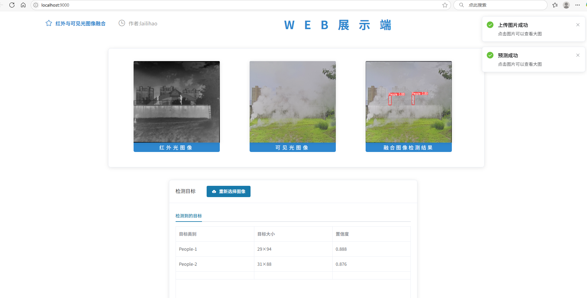

# 1. 效果：



# 2. 启动项目：

通过Docker启动，若无需要先本地安装docker，安装好后，命令行执行下面命令

拉取远程docker镜像

```
docker pull swordshisan/ivif_image:v1.0_x86
```

启动docker 容器，

```
docker run -it --name deployee -p 9000:9000 -p 9001:9001 swordshisan/ivif_image:v1.0_x86
```

启动后自动会进入docker容器内部，若需要在新开命令行进入docker容器，运行

```
docker exec -it deployee /bin/bash
```

进入容器后，进入项目文件夹，项目文件拉取github代码

```
cd /home/deployee
git clone https://github.com/SwordShiSan/FusionDetectDeployee.git
cd FusionDetectDeployee
```

进入项目文件夹后，前后端运行需要在两个终端运行，新开一个命令行即可

在 Flask 后端项目back-end下启动后端代码：

```bash
python app.py
```

在 VUE 前端项目front-end下，先安装依赖：

```bash
npm install
报错的话：先执行下面两行代码，再继续安装
npm config set proxy null
npm config set registry https://registry.npmmirror.com
```

然后运行前端：

```bash
npm run serve
```

然后在浏览器打开localhost的9000端口即可，项目test_images文件夹下有测试样例，ir后缀为红外光图像，vi后缀为可见光图像
